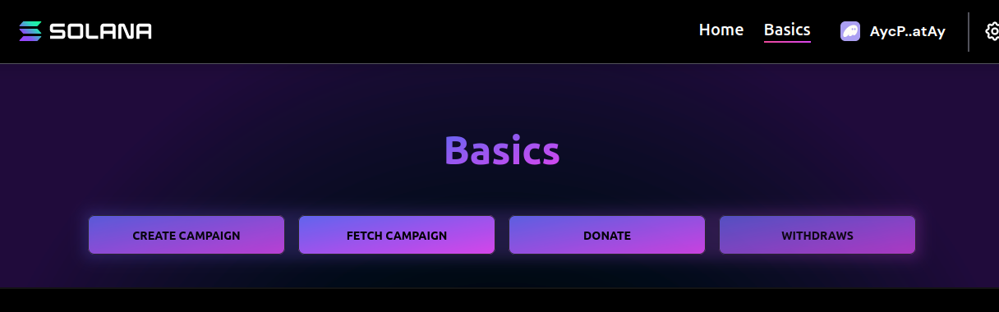

## 📚Solana Program
DonateCrypto is a simple program that allows the users donate cryptos to a campaign.

### Details
To use donate crypto we need to follow the steps:
1. **Create a campaign**
    - the author create the campaigns.
2. **Donate**
    - When we have a campaign created and activated is possible to make donations to campaing.
3. **Whithdrawls**
    - At the end of the campaing the author can withdrawl the value donated to campaign and that campaign will be fineshed.

### Frontend Web3 app
A simple front end was provided (I tried) where you can easily preform the contract operations.

